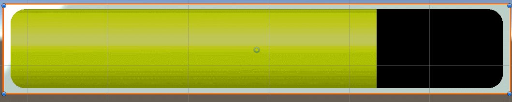

On the quest of learning shaders I wanted to do something with animated materials, reacting to some external parameter.

I was inspired for this project from one of [Freya Holmers streams](http://www.acegikmo.com/)! She provides amazing educational content. 
Miss Holmers was running like an online class on creating a healthbar, and after thinking how I would go about it, I started working on this project.

I suggest that you enable "Animated Material" so you can see how the material behaves without being in Play Mode.

I wanted the whole healthbar toL
1) be one shader
2) be framed (using sdf) 
3) the frame to be parametricized
4) the frame to be animated in some way 
5) the health itself to be animated in a different way than the frame
6) the health bar to react to the actual health level 
7) the health bar to give a sense of urgency due to the health level if there is a need for it
8) Everything to be super easy to change

the animation curves cant be easily changed without going into the shader code and changing the math
